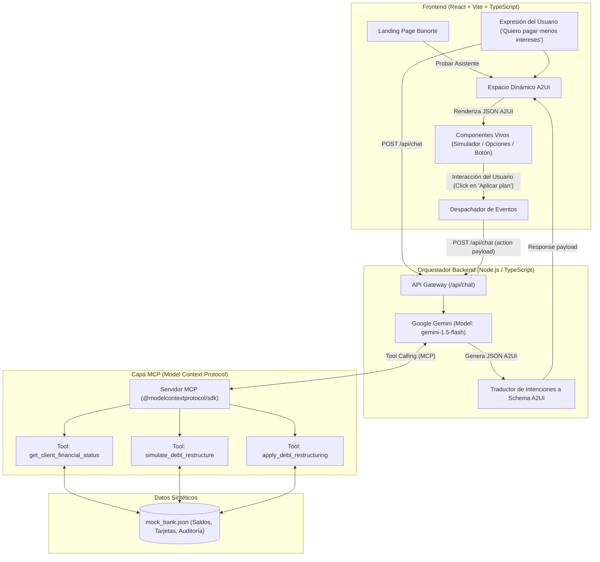

# Arquitectura del Sistema: Banorte A2UI & MCP Agent

Este documento describe las decisiones técnicas y de arquitectura requeridas para el entregable técnico del Hackathon Banorte × Tec de Monterrey.

---

## 1. Diagrama de Arquitectura de Referencia (A2UI Loop)

El sistema cierra el ciclo de interacción tal como lo exigen las reglas: la interacción sobre los componentes viaja de regreso al modelo, cerrando el bucle sin forzar al usuario a abandonar la pantalla o irse a otra aplicación.

---

## 2. Decisiones Técnicas y Justificación de Trade-Offs

| Componente | Elección | Justificación del Trade-off |
|---|---|---|
| **Frontend** | **React 18 + Vite + TypeScript + TailwindCSS** | Máxima velocidad de iteración, sin complejidad de SSR innecesaria para un dashboard interactivo de tiempo real. Compatibilidad total con tipado estricto para esquemas JSON de A2UI. |
| **LLM** | **Google Gemini (1.5 Flash / Pro)** | Ventana de contexto amplia, excelente soporte para llamadas a funciones estructuradas (Function Calling) y generación de esquemas JSON estrictos sin alucinaciones de formato. |
| **Capa de Herramientas** | **MCP (@modelcontextprotocol/sdk)** | Cumplimiento no negociable del reto. Permite desacoplar la lógica de negocio bancaria del agente, permitiendo que cualquier modelo consuma los servicios de forma estandarizada. |
| **Protocolo de Interfaz** | **A2UI Declarativo (JSON Schema)** | En lugar de pedirle al LLM que genere código HTML/React arbitrario (lo cual es inseguro y propenso a errores de renderizado), el LLM genera una **especificación declarativa de componentes pre-validados**, garantizando consistencia de diseño Banorte y seguridad contra inyección de código. |
| **Persistencia de Datos** | **Almacén Sintético JSON con Estado en Memoria** | Elimina dependencias de bases de datos externas pesadas durante el hackathon, permitiendo reiniciar el estado de la demo al instante para los jueces. |
