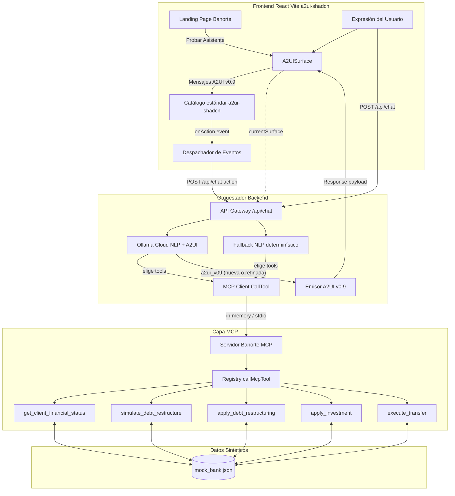

# Arquitectura del Sistema: Banorte A2UI & MCP Agent

Este documento describe las decisiones técnicas y de arquitectura requeridas para el entregable técnico del Hackathon Banorte × Tec de Monterrey.

---

## 1. Diagrama de Arquitectura de Referencia (A2UI Loop)

El sistema cierra el ciclo de interacción tal como lo exigen las reglas: la interacción sobre los componentes viaja de regreso al modelo, cerrando el bucle sin forzar al usuario a abandonar la pantalla o irse a otra aplicación.

---

## 2. Decisiones Técnicas y Justificación de Trade-Offs

| Componente | Elección | Justificación del Trade-off |
|---|---|---|
| **Frontend** | **React 18 + Vite + TypeScript + Tailwind v4 + a2ui-shadcn** | Renderer oficial A2UI v0.9; el agente usa solo el catálogo estándar (sin registry Banorte). |
| **LLM primario** | **Ollama Cloud (`gpt-oss:120b` NLP + `gemma4:31b` A2UI)** | Structured JSON; NLP elige tools; A2UI genera mensajes v0.9. |
| **Capa de Herramientas** | **MCP Client → Banorte MCP Server** | El chat usa `callMcpToolViaServer`. Solo tools bancarias (sin `get_ui_kit`). |
| **Protocolo de Interfaz** | **A2UI v0.9 iterativo** | El LLM diseña o edita `context.currentSurface` según el prompt del usuario. |
| **Resiliencia de demo** | **Fallback desde datos MCP** | Si falla el LLM en consultas, se arma una superficie mínima con resultados de tools bancarias. |
| **Persistencia de Datos** | **Almacén Sintético JSON con Estado en Memoria** | Elimina dependencias de bases de datos externas pesadas durante el hackathon, permitiendo reiniciar el estado de la demo al instante para los jueces. |
