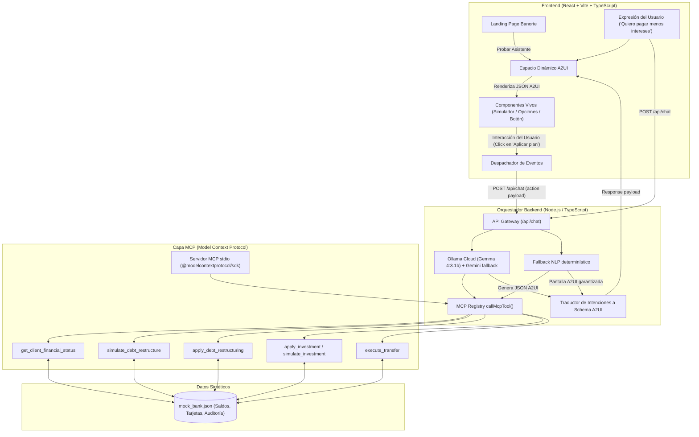

# Arquitectura del Sistema: Banorte A2UI & MCP Agent

Este documento describe las decisiones técnicas y de arquitectura requeridas para el entregable técnico del Hackathon Banorte × Tec de Monterrey.

---

## 1. Diagrama de Arquitectura de Referencia (A2UI Loop)

El sistema cierra el ciclo de interacción tal como lo exigen las reglas: la interacción sobre los componentes viaja de regreso al modelo, cerrando el bucle sin forzar al usuario a abandonar la pantalla o irse a otra aplicación.

---

## 2. Decisiones Técnicas y Justificación de Trade-Offs

| Componente | Elección | Justificación del Trade-off |
|---|---|---|
| **Frontend** | **React 18 + Vite + TypeScript + TailwindCSS** | Máxima velocidad de iteración, sin complejidad de SSR innecesaria para un dashboard interactivo de tiempo real. Compatibilidad total con tipado estricto para esquemas JSON de A2UI. |
| **LLM primario** | **Ollama Cloud (Gemma 4:3.1b)** | Structured JSON output, latencia aceptable para demo, y fallback a Gemini / NLP determinístico si no hay clave o red. |
| **Capa de Herramientas** | **MCP registry + `@modelcontextprotocol/sdk`** | Cumplimiento del reto: el orquestador HTTP y el servidor MCP stdio comparten el mismo `callMcpTool` / `MCP_TOOL_DEFINITIONS`. El hot path del chat invoca tools por nombre MCP, no imports ad-hoc. |
| **Protocolo de Interfaz** | **A2UI Declarativo (JSON Schema)** | En lugar de pedirle al LLM que genere código HTML/React arbitrario (lo cual es inseguro y propenso a errores de renderizado), el LLM genera una **especificación declarativa de componentes pre-validados**, garantizando consistencia de diseño Banorte y seguridad contra inyección de código. |
| **Resiliencia de demo** | **Fallback NLP + MCP** | Si Ollama/Gemini fallan, un clasificador de intención arma pantallas A2UI reales consultando el core vía MCP — la demo ante jueces no depende de la red. |
| **Persistencia de Datos** | **Almacén Sintético JSON con Estado en Memoria** | Elimina dependencias de bases de datos externas pesadas durante el hackathon, permitiendo reiniciar el estado de la demo al instante para los jueces. |
